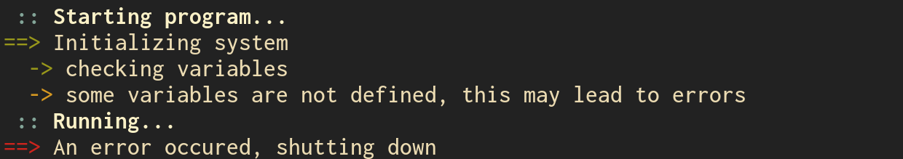

# arrowprint

Use Arch-Linux-like output in your Go programs!

Windows support through [mattn/go-colorable](https://github.com/mattn/go-colorable).

## Example



```go
arrowprint.InfoC("Starting program...")
arrowprint.Suc0("Initializing system")
arrowprint.Suc1("checking variables")
arrowprint.Warn1("some variables are not defined, this may lead to errors")
arrowprint.InfoC("Running...")
arrowprint.Err0("An error occured, shutting down")
```

## Available functions

```go
// :: message
func InfoC(msg string, args ...interface{}) { }
func SucC(msg string, args ...interface{}) { }
func WarnC(msg string, args ...interface{}) { }
func ErrC(msg string, args ...interface{}) { }

// level 0 print
// => message
func Info0(msg string, args ...interface{}) { }
func Suc0(msg string, args ...interface{}) { }
func Warn0(msg string, args ...interface{}) { }
func Err0(msg string, args ...interface{}) { }

// level 1 print
//   -> message
func Info1(msg string, args ...interface{}) { }
func Suc1(msg string, args ...interface{}) { }
func Warn1(msg string, args ...interface{}) { }
func Err1(msg string, args ...interface{}) { }
```
